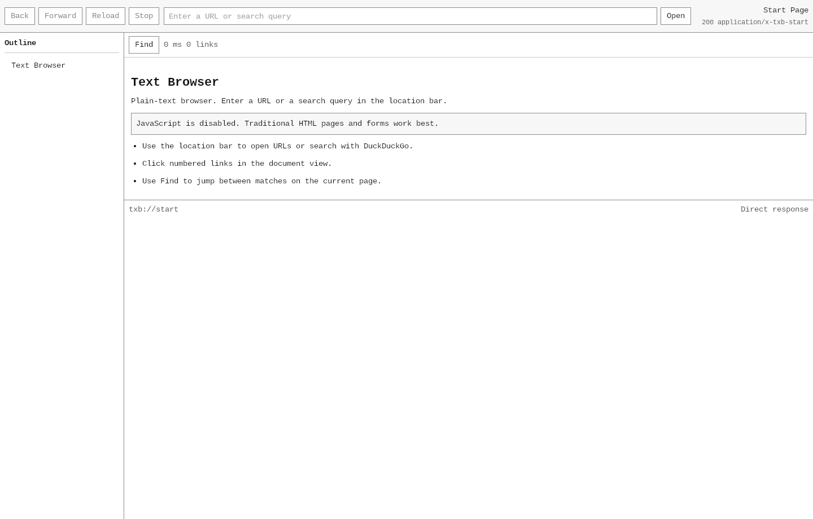

# txb

Desktop plain-text browser inspired by `w3m`.

- Native desktop app with mouse support
- Text-first rendering for HTML, Markdown, and plain text
- Clickable numbered links
- Classic HTML form support
- Back/forward, outline, and find-in-page
- No JavaScript execution



## Run

```bash
pnpm install
pnpm tauri:dev
```

## Build

```bash
pnpm build
pnpm tauri:build
```

Main outputs:

- Binary: `src-tauri/target/release/txb`
- AppImage: `src-tauri/target/release/bundle/appimage/`
- Deb: `src-tauri/target/release/bundle/deb/`
- Rpm: `src-tauri/target/release/bundle/rpm/`

## License

MIT
